# Block 1 Pooled Diagnostic

Generated from `data/processed/canonical_hourly_v1.parquet` (111,417 rows, 26 stations).

Per-station residual statistics across all 11 v1 targets, with elevation correlations and distributional inspection. Used to identify problematic stations or distributional issues before Block 2 model training.

Generated by `scripts/eda/block1_pooled_diagnostic.py`. Re-run any time after rebuilding the canonical parquet.

## Summary across targets

| target | n_pooled | pooled_mean | pooled_std | elev_r | n_stations | outliers_3sigma |
| --- | --- | --- | --- | --- | --- | --- |
| temperature | 76248 | -0.41 | 1.56 | -0.09 | 26 | 2 |
| relative_humidity | 76248 | 0.22 | 8.68 | 0.05 | 26 | 0 |
| dew_point | 76248 | 0.32 | 2.37 | -0.06 | 26 | 1 |
| wind_speed | 76248 | -6.18 | 7.49 | 0.35 | 26 | 0 |
| wind_gust | 76248 | -17.09 | 10.94 | 0.30 | 26 | 0 |
| pressure | 77864 | -5.20 | 6.09 | -0.22 | 26 | 1 |
| wind_direction | 76248 | -9.08 | 92.51 | -0.05 | 26 | 0 |
| rain_amount | 76395 | 0.19 | 0.57 | -0.05 | 26 | 1 |
| uv | 76245 | 114.53 | 202.48 | 0.12 | 26 | 1 |
| rain_occurrence | 76395 | 0.15 | nan | nan | 26 | 0 |

Notes:

- `n_pooled` is the number of trainable rows for that target (overrides applied).
- `elev_r` is the Pearson correlation between per-station mean residual and station elevation. A high |r| (>0.5) suggests an elevation effect we should investigate before training.
- `outliers_3sigma` counts stations whose mean residual is more than 3σ from the network median.

---
## Temperature residual (°C)

Pooled n = 76,248, mean = -0.413, std = 1.565.
Elevation correlation r = -0.092 (p = 0.6564).
**2 station(s) with mean > 3σ from network median.**

### Per-station statistics

| station_id | elevation_m | n | mean | std | p10 | p50 | p90 |
| --- | --- | --- | --- | --- | --- | --- | --- |
| I90583612 | 202.00 | 546 | -3.47 | 1.51 | -5.50 | -3.40 | -1.70 |
| IBARAS3 | 216.00 | 3052 | -3.36 | 1.27 | -5.00 | -3.30 | -1.81 |
| IJABAL15 | 144.00 | 3538 | -1.80 | 1.48 | -3.70 | -1.80 | 0.10 |
| IZAWIY7 | 11.00 | 3490 | -0.90 | 1.12 | -2.40 | -0.90 | 0.40 |
| IMURQU7 | 56.00 | 3465 | -0.88 | 1.25 | -2.40 | -0.80 | 0.60 |
| IJABAL14 | 654.00 | 3678 | -0.80 | 1.47 | -2.60 | -0.80 | 1.00 |
| IJANZO3 | 8.00 | 3346 | -0.59 | 1.14 | -2.00 | -0.50 | 0.80 |
| INUQAT10 | 2.00 | 3339 | -0.54 | 1.24 | -2.10 | -0.50 | 0.90 |
| INALUT3 | 64.00 | 2204 | -0.51 | 1.19 | -1.97 | -0.60 | 1.10 |
| IZAWIY5 | 2.00 | 3193 | -0.40 | 1.19 | -1.90 | -0.40 | 1.00 |
| IJABAL13 | 640.00 | 2952 | -0.29 | 1.86 | -2.70 | -0.30 | 2.10 |
| IBIRAL3 | 41.00 | 3157 | -0.28 | 1.38 | -2.00 | -0.30 | 1.30 |
| ITAHLI1 | 36.00 | 3557 | -0.28 | 1.39 | -2.00 | -0.30 | 1.40 |
| ITRIPO33 | 10.00 | 3276 | -0.16 | 1.33 | -1.80 | -0.10 | 1.20 |
| IMISRA12 | 8.00 | 2177 | -0.15 | 1.19 | -1.64 | -0.10 | 1.40 |
| INUQAT8 | 4.00 | 3756 | -0.14 | 1.14 | -1.50 | -0.10 | 1.30 |
| INUQAT9 | 3.00 | 3258 | -0.13 | 1.33 | -1.70 | -0.10 | 1.43 |
| ITRIPO32 | 8.00 | 1720 | -0.12 | 0.99 | -1.30 | -0.10 | 1.10 |
| IMURQU6 | 12.00 | 1918 | 0.06 | 1.20 | -1.30 | 0.00 | 1.60 |
| IJANZO2 | 5.00 | 3272 | 0.13 | 1.16 | -1.40 | 0.20 | 1.50 |
| IJABAL16 | 815.00 | 3166 | 0.15 | 1.33 | -1.60 | 0.20 | 1.70 |
| IJANZO4 | 21.00 | 670 | 0.17 | 1.32 | -1.50 | 0.20 | 1.80 |
| IMURQU5 | 487.00 | 2744 | 0.30 | 1.80 | -2.10 | 0.50 | 2.30 |
| IMISRA13 | 45.00 | 3555 | 0.35 | 1.21 | -1.10 | 0.40 | 1.90 |
| IALWAH18 | 16.00 | 4625 | 0.38 | 1.18 | -1.10 | 0.40 | 1.90 |
| IDERNA7 | 3.00 | 2594 | 0.81 | 1.29 | -0.80 | 0.90 | 2.30 |

### Pooled distribution

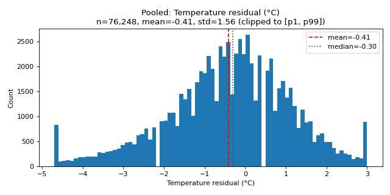

### Per-station distributions

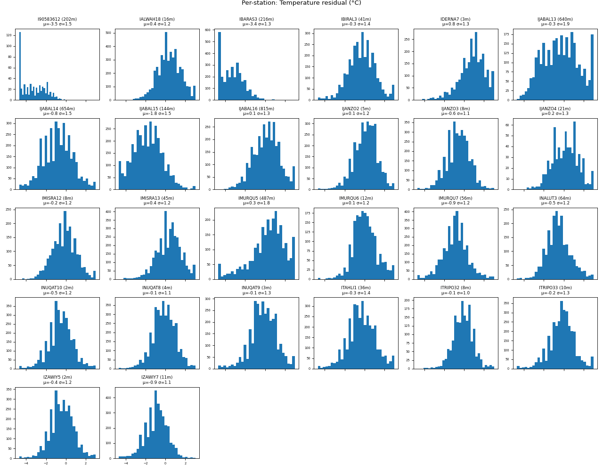

### Mean residual vs elevation

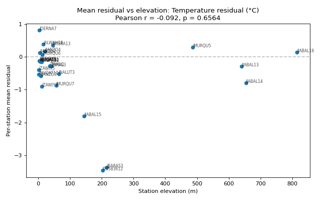

## RH residual (pct)

Pooled n = 76,248, mean = 0.221, std = 8.685.
Elevation correlation r = 0.049 (p = 0.8137).

### Per-station statistics

| station_id | elevation_m | n | mean | std | p10 | p50 | p90 |
| --- | --- | --- | --- | --- | --- | --- | --- |
| IMISRA13 | 45.00 | 3555 | -3.63 | 9.06 | -15.00 | -3.00 | 8.00 |
| IJABAL15 | 144.00 | 3538 | -3.50 | 9.20 | -16.00 | -2.00 | 7.00 |
| IMISRA12 | 8.00 | 2177 | -1.66 | 8.71 | -13.00 | -1.00 | 9.00 |
| IBIRAL3 | 41.00 | 3157 | -1.31 | 8.05 | -12.00 | 0.00 | 8.00 |
| INALUT3 | 64.00 | 2204 | -1.20 | 8.35 | -13.00 | 0.00 | 8.00 |
| IMURQU7 | 56.00 | 3465 | -1.13 | 8.28 | -12.00 | -1.00 | 8.00 |
| INUQAT8 | 4.00 | 3756 | -1.04 | 8.96 | -13.00 | 0.00 | 9.00 |
| I90583612 | 202.00 | 546 | -0.24 | 8.54 | -11.00 | 0.00 | 12.00 |
| IJANZO2 | 5.00 | 3272 | -0.20 | 9.07 | -12.00 | 0.00 | 11.00 |
| IJANZO4 | 21.00 | 670 | -0.16 | 8.84 | -13.00 | 1.00 | 9.05 |
| IJABAL16 | 815.00 | 3166 | -0.03 | 8.50 | -11.00 | 1.00 | 10.00 |
| IALWAH18 | 16.00 | 4625 | 0.08 | 6.22 | -8.00 | 1.00 | 7.00 |
| IDERNA7 | 3.00 | 2594 | 0.12 | 9.99 | -11.00 | -1.00 | 13.00 |
| ITRIPO32 | 8.00 | 1720 | 0.15 | 8.01 | -10.00 | 0.00 | 10.00 |
| IMURQU6 | 12.00 | 1918 | 0.48 | 8.02 | -10.00 | 1.00 | 10.00 |
| IJABAL14 | 654.00 | 3678 | 0.54 | 8.43 | -11.00 | 1.00 | 10.00 |
| INUQAT10 | 2.00 | 3339 | 0.57 | 7.97 | -10.00 | 1.00 | 10.00 |
| IMURQU5 | 487.00 | 2744 | 0.78 | 9.37 | -11.00 | 2.00 | 11.00 |
| ITAHLI1 | 36.00 | 3557 | 0.84 | 8.68 | -11.00 | 2.00 | 10.00 |
| IJABAL13 | 640.00 | 2952 | 0.85 | 9.26 | -12.00 | 2.00 | 11.00 |
| ITRIPO33 | 10.00 | 3276 | 1.03 | 9.39 | -11.00 | 1.00 | 12.00 |
| INUQAT9 | 3.00 | 3258 | 1.77 | 8.82 | -10.00 | 3.00 | 11.00 |
| IZAWIY5 | 2.00 | 3193 | 1.78 | 8.11 | -9.00 | 3.00 | 10.00 |
| IZAWIY7 | 11.00 | 3490 | 2.90 | 7.81 | -7.00 | 4.00 | 12.00 |
| IBARAS3 | 216.00 | 3052 | 3.40 | 7.38 | -6.00 | 4.00 | 12.00 |
| IJANZO3 | 8.00 | 3346 | 3.79 | 8.03 | -7.00 | 4.00 | 13.00 |

### Pooled distribution

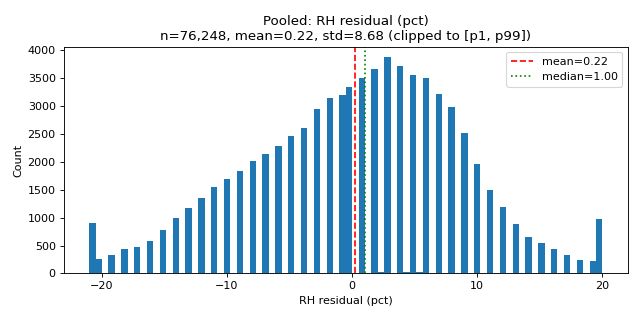

### Per-station distributions

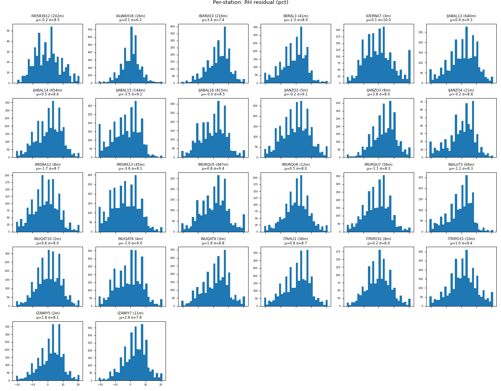

### Mean residual vs elevation

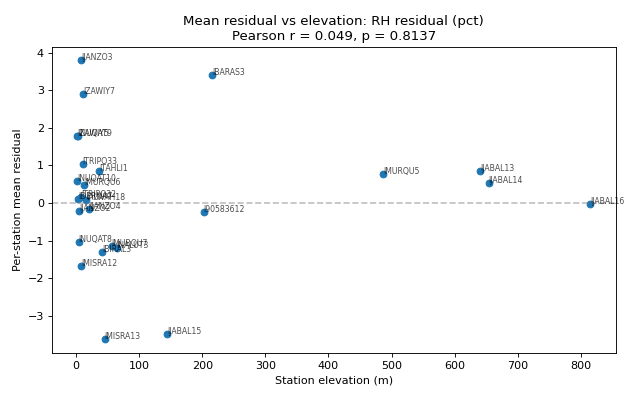

## Dew point residual (°C)

Pooled n = 76,248, mean = 0.317, std = 2.366.
Elevation correlation r = -0.057 (p = 0.7836).
**1 station(s) with mean > 3σ from network median.**

### Per-station statistics

| station_id | elevation_m | n | mean | std | p10 | p50 | p90 |
| --- | --- | --- | --- | --- | --- | --- | --- |
| I90583612 | 202.00 | 546 | -2.62 | 2.05 | -4.70 | -3.10 | 0.10 |
| IJABAL15 | 144.00 | 3538 | -1.93 | 2.25 | -4.50 | -2.20 | 1.00 |
| IBARAS3 | 216.00 | 3052 | -1.44 | 2.06 | -3.80 | -1.70 | 1.30 |
| IMURQU7 | 56.00 | 3465 | -0.57 | 2.20 | -3.00 | -0.80 | 2.30 |
| IMISRA12 | 8.00 | 2177 | -0.12 | 2.07 | -2.40 | -0.40 | 2.50 |
| IBIRAL3 | 41.00 | 3157 | -0.04 | 2.14 | -2.50 | -0.30 | 2.80 |
| INALUT3 | 64.00 | 2204 | -0.02 | 2.22 | -2.50 | -0.30 | 3.00 |
| IMISRA13 | 45.00 | 3555 | 0.03 | 2.12 | -2.20 | -0.40 | 2.90 |
| IJABAL14 | 654.00 | 3678 | 0.07 | 1.94 | -2.03 | -0.20 | 2.70 |
| INUQAT10 | 2.00 | 3339 | 0.26 | 2.25 | -2.10 | -0.10 | 3.22 |
| INUQAT8 | 4.00 | 3756 | 0.32 | 2.42 | -2.10 | -0.10 | 3.50 |
| ITRIPO32 | 8.00 | 1720 | 0.47 | 2.12 | -1.60 | 0.10 | 3.40 |
| IZAWIY7 | 11.00 | 3490 | 0.63 | 2.40 | -1.90 | 0.30 | 3.80 |
| IJABAL13 | 640.00 | 2952 | 0.64 | 2.04 | -1.70 | 0.40 | 3.40 |
| IJABAL16 | 815.00 | 3166 | 0.74 | 1.96 | -1.50 | 0.50 | 3.40 |
| IALWAH18 | 16.00 | 4625 | 0.75 | 1.87 | -1.60 | 0.80 | 3.00 |
| ITAHLI1 | 36.00 | 3557 | 0.76 | 2.34 | -1.90 | 0.40 | 4.00 |
| IMURQU6 | 12.00 | 1918 | 0.78 | 2.23 | -1.60 | 0.40 | 3.60 |
| ITRIPO33 | 10.00 | 3276 | 0.79 | 2.42 | -1.70 | 0.40 | 4.05 |
| IZAWIY5 | 2.00 | 3193 | 0.81 | 2.43 | -1.60 | 0.50 | 3.90 |
| IJANZO2 | 5.00 | 3272 | 0.81 | 2.44 | -1.69 | 0.30 | 4.10 |
| IJANZO4 | 21.00 | 670 | 0.94 | 2.43 | -1.80 | 0.60 | 4.50 |
| INUQAT9 | 3.00 | 3258 | 1.04 | 2.40 | -1.60 | 0.70 | 4.10 |
| IJANZO3 | 8.00 | 3346 | 1.11 | 2.34 | -1.30 | 0.80 | 4.20 |
| IMURQU5 | 487.00 | 2744 | 1.14 | 2.48 | -1.70 | 0.90 | 4.30 |
| IDERNA7 | 3.00 | 2594 | 1.22 | 2.09 | -0.90 | 0.90 | 3.80 |

### Pooled distribution

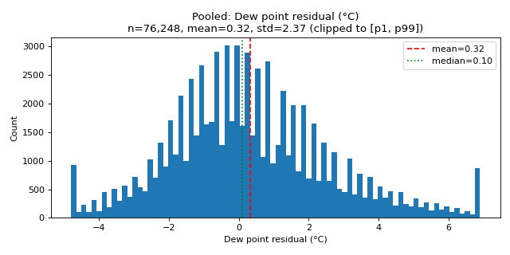

### Per-station distributions

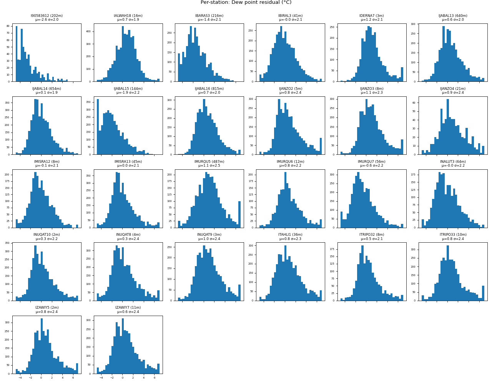

### Mean residual vs elevation

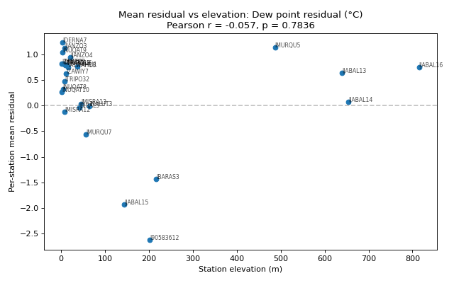

## Wind speed residual (km/h)

Pooled n = 76,248, mean = -6.176, std = 7.489.
Elevation correlation r = 0.349 (p = 0.0802).

### Per-station statistics

| station_id | elevation_m | n | mean | std | p10 | p50 | p90 |
| --- | --- | --- | --- | --- | --- | --- | --- |
| INUQAT10 | 2.00 | 3339 | -13.74 | 7.28 | -23.52 | -12.70 | -5.20 |
| ITAHLI1 | 36.00 | 3557 | -13.22 | 7.20 | -22.90 | -12.20 | -4.60 |
| IJANZO2 | 5.00 | 3272 | -13.18 | 6.55 | -22.00 | -12.40 | -5.20 |
| INUQAT9 | 3.00 | 3258 | -12.40 | 6.72 | -21.63 | -11.20 | -4.80 |
| IDERNA7 | 3.00 | 2594 | -11.42 | 6.02 | -18.90 | -11.10 | -4.00 |
| IJABAL16 | 815.00 | 3166 | -9.56 | 6.10 | -17.90 | -9.00 | -2.20 |
| IBARAS3 | 216.00 | 3052 | -8.75 | 6.44 | -17.40 | -8.10 | -1.20 |
| IMURQU7 | 56.00 | 3465 | -8.11 | 5.55 | -15.40 | -7.80 | -1.20 |
| IJANZO3 | 8.00 | 3346 | -6.75 | 4.36 | -12.40 | -6.60 | -1.45 |
| IMISRA13 | 45.00 | 3555 | -6.65 | 4.50 | -12.50 | -6.30 | -1.30 |
| IZAWIY5 | 2.00 | 3193 | -6.60 | 4.21 | -11.90 | -6.60 | -1.30 |
| IZAWIY7 | 11.00 | 3490 | -5.72 | 3.86 | -10.60 | -5.60 | -1.00 |
| INUQAT8 | 4.00 | 3756 | -5.57 | 4.62 | -11.50 | -5.30 | 0.00 |
| IJABAL15 | 144.00 | 3538 | -4.88 | 4.52 | -10.60 | -4.80 | 0.80 |
| IALWAH18 | 16.00 | 4625 | -4.70 | 4.11 | -9.90 | -4.50 | 0.20 |
| IBIRAL3 | 41.00 | 3157 | -4.61 | 5.85 | -12.00 | -4.00 | 1.80 |
| I90583612 | 202.00 | 546 | -4.40 | 6.08 | -13.90 | -3.20 | 1.75 |
| INALUT3 | 64.00 | 2204 | -4.35 | 5.35 | -11.00 | -4.10 | 2.10 |
| IMURQU5 | 487.00 | 2744 | -3.13 | 6.64 | -10.70 | -3.80 | 5.80 |
| IMURQU6 | 12.00 | 1918 | -2.50 | 6.04 | -9.30 | -3.20 | 5.60 |
| ITRIPO33 | 10.00 | 3276 | -2.03 | 4.93 | -8.45 | -2.10 | 4.40 |
| ITRIPO32 | 8.00 | 1720 | -1.98 | 3.73 | -6.41 | -2.20 | 2.70 |
| IJANZO4 | 21.00 | 670 | -1.53 | 4.85 | -7.20 | -1.60 | 5.00 |
| IMISRA12 | 8.00 | 2177 | -1.44 | 5.28 | -8.00 | -1.50 | 4.80 |
| IJABAL14 | 654.00 | 3678 | -0.79 | 5.12 | -7.40 | -0.45 | 5.23 |
| IJABAL13 | 640.00 | 2952 | 8.28 | 9.95 | -2.10 | 6.30 | 22.40 |

### Pooled distribution

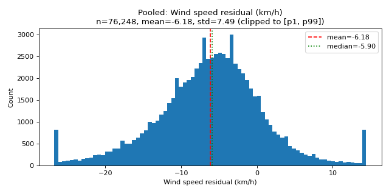

### Per-station distributions

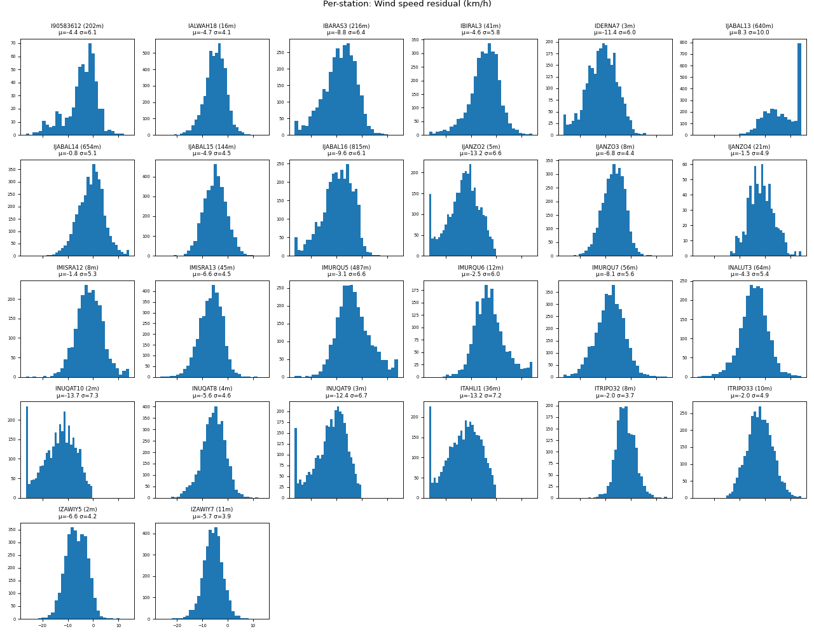

### Mean residual vs elevation

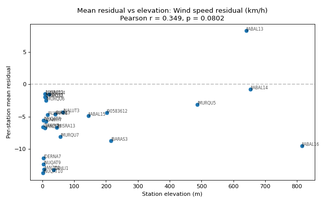

## Wind gust residual (km/h)

Pooled n = 76,248, mean = -17.093, std = 10.944.
Elevation correlation r = 0.301 (p = 0.1356).

### Per-station statistics

| station_id | elevation_m | n | mean | std | p10 | p50 | p90 |
| --- | --- | --- | --- | --- | --- | --- | --- |
| IJANZO2 | 5.00 | 3272 | -27.90 | 13.63 | -46.80 | -26.00 | -12.30 |
| IDERNA7 | 3.00 | 2594 | -26.18 | 12.27 | -42.00 | -25.10 | -11.40 |
| ITAHLI1 | 36.00 | 3557 | -25.22 | 12.80 | -42.80 | -23.60 | -10.10 |
| INUQAT10 | 2.00 | 3339 | -23.99 | 12.30 | -40.80 | -22.00 | -10.10 |
| INUQAT9 | 3.00 | 3258 | -23.03 | 12.02 | -40.10 | -20.90 | -9.70 |
| IJABAL16 | 815.00 | 3166 | -21.70 | 11.13 | -36.85 | -21.10 | -7.30 |
| IZAWIY5 | 2.00 | 3193 | -20.17 | 8.51 | -31.18 | -19.60 | -9.40 |
| IJANZO3 | 8.00 | 3346 | -19.38 | 8.73 | -30.55 | -19.20 | -8.60 |
| IBARAS3 | 216.00 | 3052 | -18.92 | 10.64 | -32.90 | -18.40 | -5.91 |
| IZAWIY7 | 11.00 | 3490 | -18.73 | 8.44 | -29.80 | -18.20 | -8.20 |
| IMURQU7 | 56.00 | 3465 | -17.02 | 7.89 | -27.00 | -16.60 | -7.40 |
| INUQAT8 | 4.00 | 3756 | -16.59 | 8.11 | -27.80 | -15.60 | -7.60 |
| ITRIPO33 | 10.00 | 3276 | -16.39 | 8.20 | -27.50 | -15.60 | -6.40 |
| IMURQU6 | 12.00 | 1918 | -16.13 | 8.58 | -27.40 | -15.60 | -5.80 |
| ITRIPO32 | 8.00 | 1720 | -16.07 | 7.61 | -26.01 | -15.20 | -7.60 |
| I90583612 | 202.00 | 546 | -14.85 | 11.75 | -33.80 | -12.30 | -2.35 |
| IMISRA13 | 45.00 | 3555 | -14.01 | 6.98 | -23.20 | -13.60 | -5.40 |
| IALWAH18 | 16.00 | 4625 | -13.30 | 6.25 | -20.90 | -13.00 | -5.60 |
| IBIRAL3 | 41.00 | 3157 | -12.65 | 7.60 | -22.30 | -11.60 | -4.50 |
| IJABAL14 | 654.00 | 3678 | -12.59 | 9.00 | -25.00 | -11.70 | -1.60 |
| IJABAL15 | 144.00 | 3538 | -12.56 | 6.49 | -21.10 | -12.40 | -4.60 |
| INALUT3 | 64.00 | 2204 | -12.27 | 7.91 | -22.60 | -11.50 | -3.00 |
| IJANZO4 | 21.00 | 670 | -11.83 | 6.77 | -20.21 | -11.60 | -3.40 |
| IMURQU5 | 487.00 | 2744 | -11.58 | 7.00 | -20.40 | -11.00 | -3.60 |
| IMISRA12 | 8.00 | 2177 | -7.54 | 6.14 | -14.60 | -7.20 | -0.60 |
| IJABAL13 | 640.00 | 2952 | -3.85 | 10.22 | -15.20 | -4.50 | 9.20 |

### Pooled distribution

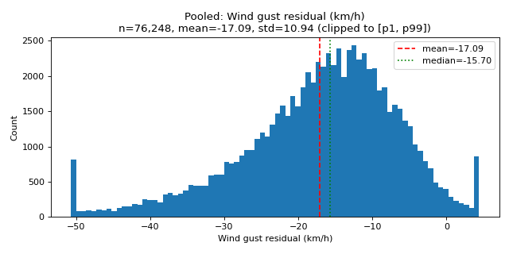

### Per-station distributions

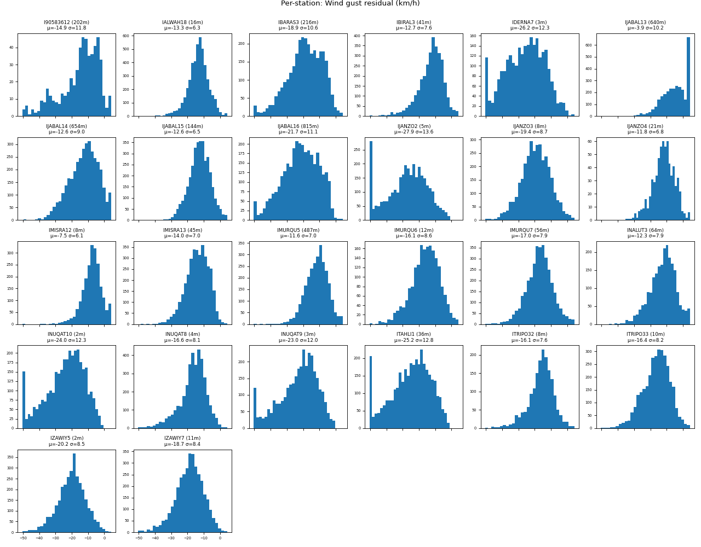

### Mean residual vs elevation

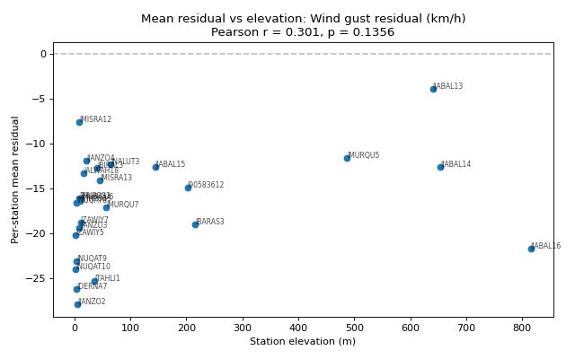

## Pressure residual (hPa)

Pooled n = 77,864, mean = -5.199, std = 6.086.
Elevation correlation r = -0.223 (p = 0.2847).
**1 station(s) with mean > 3σ from network median.**

### Per-station statistics

| station_id | elevation_m | n | mean | std | p10 | p50 | p90 |
| --- | --- | --- | --- | --- | --- | --- | --- |
| IBIRAL3 | 41.00 | 3548 | -16.38 | 0.37 | -16.85 | -16.38 | -15.90 |
| IJABAL14 | 654.00 | 3678 | -11.48 | 1.89 | -13.61 | -11.90 | -8.40 |
| IALWAH18 | 16.00 | 4625 | -8.47 | 3.91 | -10.45 | -9.76 | -4.10 |
| IMISRA13 | 45.00 | 3555 | -8.36 | 0.35 | -8.79 | -8.38 | -7.92 |
| ITRIPO33 | 10.00 | 3176 | -5.47 | 6.02 | -11.83 | -7.44 | 2.74 |
| I90583612 | 202.00 | 546 | -5.27 | 5.34 | -13.08 | -4.07 | 1.49 |
| INUQAT10 | 2.00 | 3339 | -5.16 | 4.51 | -8.76 | -6.47 | -1.25 |
| IJABAL16 | 815.00 | 3365 | -5.10 | 6.35 | -12.62 | -5.00 | 3.17 |
| IMURQU6 | 12.00 | 1980 | -5.00 | 5.66 | -11.96 | -6.48 | 3.90 |
| IJANZO3 | 8.00 | 3574 | -4.77 | 5.25 | -9.27 | -7.71 | 5.39 |
| INUQAT9 | 3.00 | 3352 | -4.75 | 0.54 | -5.22 | -4.81 | -4.37 |
| IZAWIY7 | 11.00 | 3600 | -4.43 | 5.73 | -10.05 | -6.31 | 6.20 |
| IJANZO4 | 21.00 | 673 | -4.31 | 5.70 | -10.89 | -5.15 | 3.36 |
| IJABAL15 | 144.00 | 3681 | -4.21 | 5.77 | -9.50 | -6.98 | 4.04 |
| IMURQU5 | 487.00 | 2821 | -4.03 | 6.27 | -11.99 | -4.48 | 4.23 |
| IBARAS3 | 216.00 | 3522 | -3.82 | 5.23 | -10.51 | -4.14 | 3.55 |
| IZAWIY5 | 2.00 | 3542 | -3.68 | 5.97 | -11.80 | -3.66 | 3.28 |
| ITAHLI1 | 36.00 | 3557 | -2.90 | 5.95 | -8.32 | -3.83 | 5.54 |
| IDERNA7 | 3.00 | 3205 | -2.87 | 4.53 | -8.93 | -3.30 | 4.09 |
| INUQAT8 | 4.00 | 3756 | -2.86 | 4.84 | -9.02 | -2.09 | 6.18 |
| IMURQU7 | 56.00 | 3466 | -2.83 | 6.96 | -11.72 | -2.53 | 7.19 |
| INALUT3 | 64.00 | 2554 | -2.61 | 5.51 | -9.55 | -1.80 | 4.65 |
| ITRIPO32 | 8.00 | 1720 | -2.40 | 5.01 | -9.10 | -1.46 | 3.59 |
| IMISRA12 | 8.00 | 3402 | -2.27 | 6.44 | -10.27 | -3.88 | 7.90 |
| IJANZO2 | 5.00 | 3627 | -2.01 | 5.85 | -8.30 | -4.53 | 8.10 |
| IJABAL13 | 640.00 | 0 | nan | nan | nan | nan | nan |

### Pooled distribution

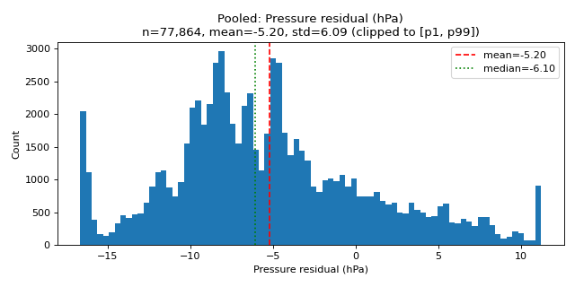

### Per-station distributions

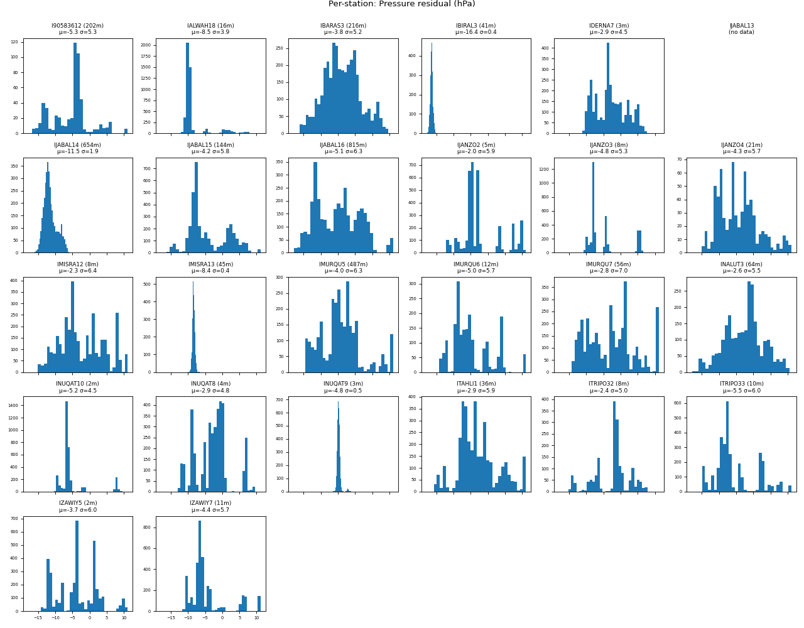

### Mean residual vs elevation

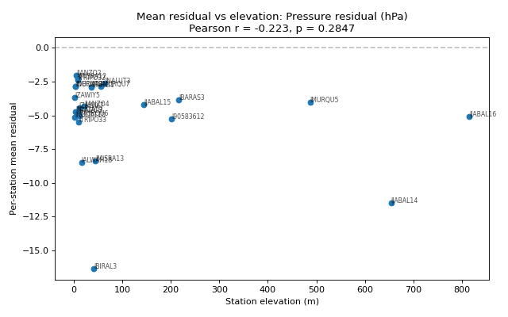

## Wind direction residual (deg)

Pooled n = 76,248, mean = -9.085, std = 92.509.
Elevation correlation r = -0.051 (p = 0.8038).

### Per-station statistics

| station_id | elevation_m | n | mean | std | p10 | p50 | p90 |
| --- | --- | --- | --- | --- | --- | --- | --- |
| IMISRA13 | 45.00 | 3555 | -101.51 | 66.23 | -149.00 | -121.00 | -31.00 |
| IMURQU5 | 487.00 | 2744 | -92.98 | 82.29 | -153.00 | -120.00 | 42.70 |
| IJABAL15 | 144.00 | 3538 | -77.48 | 98.70 | -155.00 | -117.00 | 125.30 |
| IMURQU7 | 56.00 | 3465 | -22.56 | 49.01 | -65.00 | -25.00 | 19.60 |
| I90583612 | 202.00 | 546 | -21.37 | 100.40 | -149.00 | -6.00 | 102.50 |
| INUQAT8 | 4.00 | 3756 | -17.36 | 40.74 | -51.00 | -18.00 | 14.00 |
| INALUT3 | 64.00 | 2204 | -17.19 | 46.11 | -70.70 | -13.00 | 25.00 |
| ITRIPO32 | 8.00 | 1720 | -13.50 | 32.48 | -43.10 | -11.00 | 11.00 |
| IALWAH18 | 16.00 | 4625 | -11.69 | 52.11 | -67.00 | -14.00 | 43.60 |
| IJABAL13 | 640.00 | 2952 | -9.78 | 85.58 | -150.00 | 11.00 | 85.00 |
| ITRIPO33 | 10.00 | 3276 | -8.36 | 41.23 | -41.00 | -11.00 | 23.00 |
| IZAWIY7 | 11.00 | 3490 | -5.73 | 37.81 | -42.00 | -6.00 | 32.00 |
| IBIRAL3 | 41.00 | 3157 | -5.03 | 145.10 | -173.00 | -29.00 | 173.00 |
| INUQAT9 | 3.00 | 3258 | -1.84 | 99.53 | -140.00 | 0.00 | 139.00 |
| IBARAS3 | 216.00 | 3052 | -0.50 | 150.91 | -173.00 | -9.50 | 173.00 |
| IJANZO3 | 8.00 | 3346 | -0.25 | 43.80 | -41.00 | -3.00 | 49.00 |
| INUQAT10 | 2.00 | 3339 | 1.33 | 103.63 | -142.20 | 2.00 | 142.20 |
| ITAHLI1 | 36.00 | 3557 | 3.19 | 100.89 | -138.00 | 6.00 | 141.00 |
| IZAWIY5 | 2.00 | 3193 | 4.63 | 45.16 | -36.00 | 6.00 | 43.00 |
| IJANZO4 | 21.00 | 670 | 8.79 | 49.27 | -34.10 | 10.00 | 56.10 |
| IJANZO2 | 5.00 | 3272 | 14.08 | 112.49 | -150.00 | 28.00 | 156.00 |
| IJABAL14 | 654.00 | 3678 | 16.73 | 37.11 | -11.00 | 18.00 | 46.00 |
| IJABAL16 | 815.00 | 3166 | 32.72 | 83.00 | -105.00 | 51.00 | 127.00 |
| IDERNA7 | 3.00 | 2594 | 39.02 | 123.17 | -152.00 | 106.00 | 161.00 |
| IMURQU6 | 12.00 | 1918 | 44.06 | 31.77 | 20.00 | 46.00 | 70.00 |
| IMISRA12 | 8.00 | 2177 | 61.90 | 145.85 | -173.00 | 153.00 | 174.00 |

### Pooled distribution

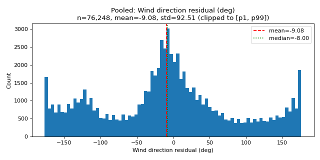

### Per-station distributions

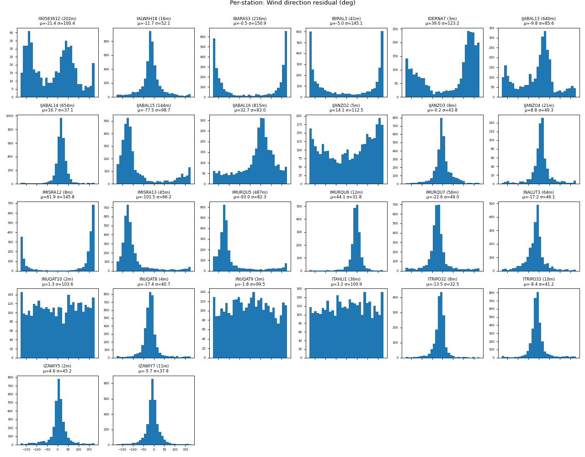

### Mean residual vs elevation

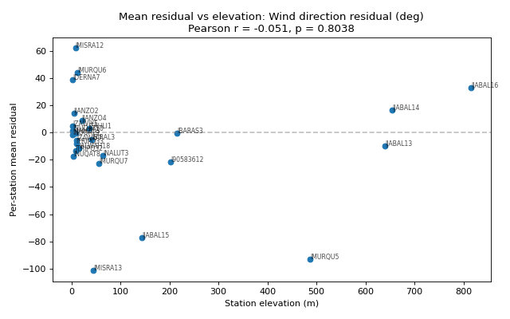

## Rain amount log1p

Pooled n = 76,395, mean = 0.191, std = 0.574.
Elevation correlation r = -0.050 (p = 0.8114).
**1 station(s) with mean > 3σ from network median.**

### Per-station statistics

| station_id | elevation_m | n | mean | std | p10 | p50 | p90 |
| --- | --- | --- | --- | --- | --- | --- | --- |
| IALWAH18 | 16.00 | 4625 | 0.01 | 0.08 | 0.00 | 0.00 | 0.00 |
| IBIRAL3 | 41.00 | 3548 | 0.05 | 0.26 | 0.00 | 0.00 | 0.00 |
| INUQAT9 | 3.00 | 3352 | 0.09 | 0.42 | 0.00 | 0.00 | 0.00 |
| IZAWIY7 | 11.00 | 3588 | 0.09 | 0.35 | 0.00 | 0.00 | 0.22 |
| IJABAL14 | 654.00 | 3678 | 0.10 | 0.39 | 0.00 | 0.00 | 0.00 |
| IJABAL15 | 144.00 | 3681 | 0.10 | 0.39 | 0.00 | 0.00 | 0.22 |
| IMISRA13 | 45.00 | 3555 | 0.11 | 0.40 | 0.00 | 0.00 | 0.07 |
| IJANZO3 | 8.00 | 3574 | 0.12 | 0.46 | 0.00 | 0.00 | 0.22 |
| INUQAT10 | 2.00 | 3339 | 0.13 | 0.54 | 0.00 | 0.00 | 0.00 |
| IBARAS3 | 216.00 | 3390 | 0.13 | 0.40 | 0.00 | 0.00 | 0.22 |
| IJABAL13 | 640.00 | 3583 | 0.14 | 0.48 | 0.00 | 0.00 | 0.41 |
| IZAWIY5 | 2.00 | 3538 | 0.15 | 0.52 | 0.00 | 0.00 | 0.41 |
| ITRIPO33 | 10.00 | 3280 | 0.16 | 0.47 | 0.00 | 0.00 | 0.70 |
| IMISRA12 | 8.00 | 2706 | 0.16 | 0.45 | 0.00 | 0.00 | 0.41 |
| ITRIPO32 | 8.00 | 1720 | 0.18 | 0.52 | 0.00 | 0.00 | 0.41 |
| IJANZO2 | 5.00 | 3609 | 0.19 | 0.55 | 0.00 | 0.00 | 0.82 |
| IMURQU6 | 12.00 | 1973 | 0.19 | 0.48 | 0.00 | 0.00 | 0.70 |
| INUQAT8 | 4.00 | 3756 | 0.20 | 0.61 | 0.00 | 0.00 | 0.70 |
| IJABAL16 | 815.00 | 3341 | 0.26 | 0.73 | 0.00 | 0.00 | 0.92 |
| IMURQU5 | 487.00 | 2759 | 0.36 | 0.82 | 0.00 | 0.00 | 1.99 |
| IDERNA7 | 3.00 | 2671 | 0.37 | 0.75 | 0.00 | 0.00 | 1.11 |
| ITAHLI1 | 36.00 | 3557 | 0.38 | 0.78 | 0.00 | 0.00 | 1.99 |
| I90583612 | 202.00 | 546 | 0.61 | 1.08 | 0.00 | 0.00 | 2.72 |
| INALUT3 | 64.00 | 2356 | 0.66 | 0.92 | 0.00 | 0.22 | 2.18 |
| IJANZO4 | 21.00 | 670 | 1.70 | 0.98 | 0.00 | 1.52 | 2.76 |
| IMURQU7 | 56.00 | 0 | nan | nan | nan | nan | nan |

### Pooled distribution

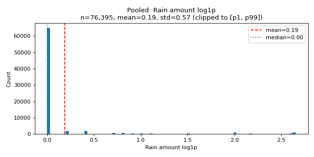

### Per-station distributions

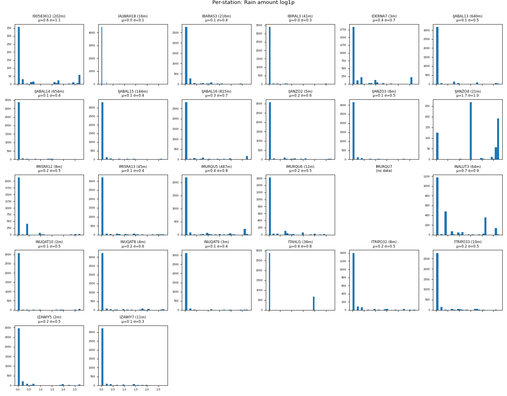

### Mean residual vs elevation

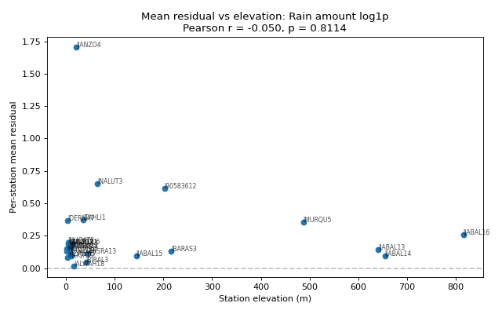

## UV proxy

Pooled n = 76,245, mean = 114.526, std = 202.476.
Elevation correlation r = 0.124 (p = 0.5461).
**1 station(s) with mean > 3σ from network median.**

### Per-station statistics

| station_id | elevation_m | n | mean | std | p10 | p50 | p90 |
| --- | --- | --- | --- | --- | --- | --- | --- |
| I90583612 | 202.00 | 546 | 85.92 | 175.14 | 0.00 | 0.00 | 375.80 |
| ITRIPO32 | 8.00 | 1720 | 89.56 | 168.66 | 0.00 | 0.00 | 380.70 |
| IZAWIY7 | 11.00 | 3490 | 100.55 | 183.87 | 0.00 | 0.00 | 436.17 |
| IMISRA13 | 45.00 | 3555 | 101.41 | 186.81 | 0.00 | 0.00 | 438.69 |
| ITRIPO33 | 10.00 | 3276 | 102.31 | 183.74 | 0.00 | 0.00 | 432.70 |
| ITAHLI1 | 36.00 | 3557 | 102.47 | 188.84 | 0.00 | 0.00 | 453.09 |
| IZAWIY5 | 2.00 | 3193 | 104.32 | 188.12 | 0.00 | 0.00 | 451.63 |
| INUQAT9 | 3.00 | 3257 | 104.39 | 188.21 | 0.00 | 0.00 | 449.44 |
| IJANZO3 | 8.00 | 3346 | 105.34 | 187.60 | 0.00 | 0.00 | 444.38 |
| INUQAT10 | 2.00 | 3339 | 105.53 | 189.56 | 0.00 | 0.00 | 455.45 |
| IMURQU7 | 56.00 | 3465 | 107.01 | 191.85 | 0.00 | 0.00 | 454.32 |
| INUQAT8 | 4.00 | 3756 | 107.33 | 193.77 | 0.00 | 0.00 | 461.04 |
| IMURQU5 | 487.00 | 2744 | 108.08 | 197.18 | 0.00 | 0.00 | 470.37 |
| IMURQU6 | 12.00 | 1918 | 108.08 | 186.26 | 0.00 | 0.00 | 449.00 |
| IJANZO2 | 5.00 | 3272 | 109.53 | 189.75 | 0.00 | 0.00 | 446.79 |
| IJABAL14 | 654.00 | 3677 | 113.39 | 203.76 | 0.00 | 0.00 | 485.54 |
| IJABAL16 | 815.00 | 3166 | 115.42 | 207.06 | 0.00 | 0.00 | 491.32 |
| IJANZO4 | 21.00 | 670 | 116.98 | 207.10 | 0.00 | 0.00 | 491.44 |
| IMISRA12 | 8.00 | 2177 | 117.82 | 196.41 | 0.00 | 0.00 | 480.38 |
| IBARAS3 | 216.00 | 3052 | 119.41 | 206.48 | 0.00 | 0.00 | 498.44 |
| IBIRAL3 | 41.00 | 3157 | 120.22 | 204.97 | 0.00 | 0.00 | 488.83 |
| INALUT3 | 64.00 | 2204 | 123.82 | 218.46 | 0.00 | 0.00 | 530.93 |
| IJABAL15 | 144.00 | 3538 | 127.60 | 217.70 | 0.00 | 0.00 | 525.30 |
| IJABAL13 | 640.00 | 2952 | 134.39 | 214.44 | 0.00 | 0.00 | 518.34 |
| IDERNA7 | 3.00 | 2594 | 143.98 | 243.21 | 0.00 | 0.00 | 543.81 |
| IALWAH18 | 16.00 | 4624 | 162.22 | 258.66 | 0.00 | 0.00 | 623.70 |

### Pooled distribution

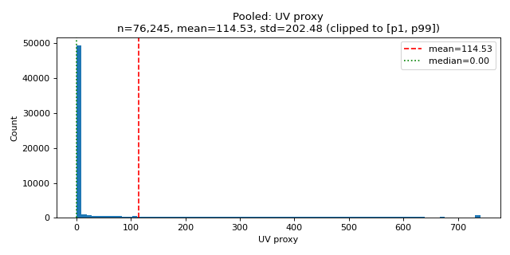

### Per-station distributions

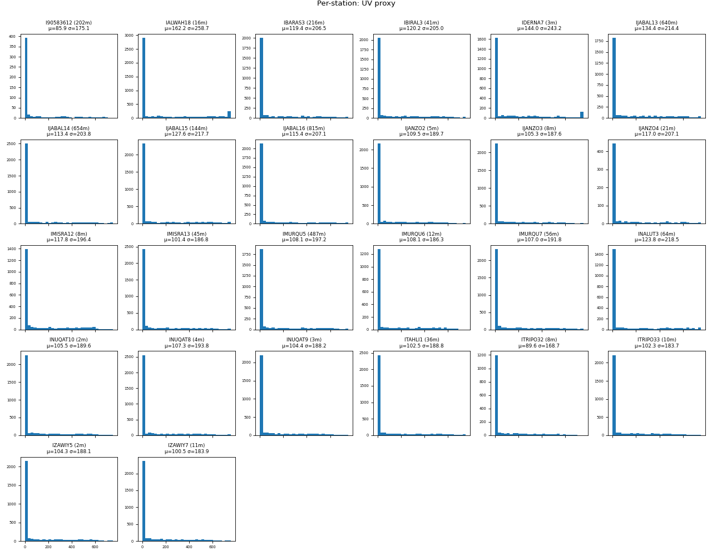

### Mean residual vs elevation

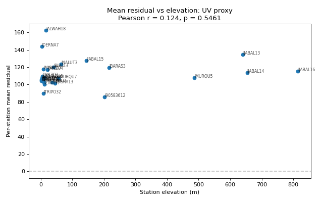

## Rain occurrence (binary)

Pooled rain hours: 11,537 / 76,395 (15.10%).

### Per-station rain rate

| station_id | elevation_m | n | rain_hours | rain_fraction |
| --- | --- | --- | --- | --- |
| IJANZO4 | 21.00 | 670 | 544 | 0.81 |
| INALUT3 | 64.00 | 2356 | 1181 | 0.50 |
| I90583612 | 202.00 | 546 | 189 | 0.35 |
| IDERNA7 | 3.00 | 2671 | 837 | 0.31 |
| IMISRA12 | 8.00 | 2706 | 571 | 0.21 |
| IMURQU5 | 487.00 | 2759 | 570 | 0.21 |
| ITAHLI1 | 36.00 | 3557 | 672 | 0.19 |
| ITRIPO32 | 8.00 | 1720 | 317 | 0.18 |
| IBARAS3 | 216.00 | 3390 | 613 | 0.18 |
| IMURQU6 | 12.00 | 1973 | 353 | 0.18 |
| IZAWIY5 | 2.00 | 3538 | 567 | 0.16 |
| IJABAL16 | 815.00 | 3341 | 524 | 0.16 |
| ITRIPO33 | 10.00 | 3280 | 499 | 0.15 |
| IJANZO2 | 5.00 | 3609 | 528 | 0.15 |
| INUQAT8 | 4.00 | 3756 | 518 | 0.14 |
| IJANZO3 | 8.00 | 3574 | 423 | 0.12 |
| IJABAL13 | 640.00 | 3583 | 404 | 0.11 |
| IJABAL15 | 144.00 | 3681 | 375 | 0.10 |
| IZAWIY7 | 11.00 | 3588 | 365 | 0.10 |
| IMISRA13 | 45.00 | 3555 | 356 | 0.10 |
| IJABAL14 | 654.00 | 3678 | 304 | 0.08 |
| INUQAT10 | 2.00 | 3339 | 253 | 0.08 |
| INUQAT9 | 3.00 | 3352 | 230 | 0.07 |
| IBIRAL3 | 41.00 | 3548 | 153 | 0.04 |
| IALWAH18 | 16.00 | 4625 | 191 | 0.04 |
| IMURQU7 | 56.00 | 0 | 0 | nan |

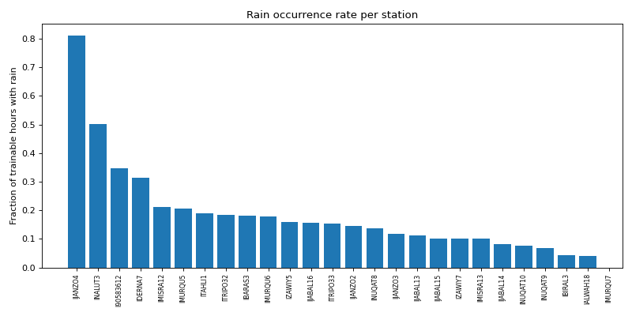
